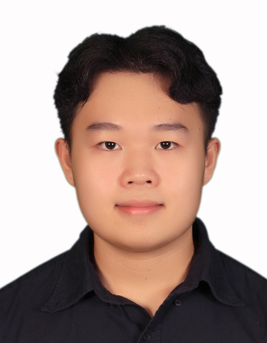
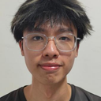

We are a team based in the [School of Computing, National University of Singapore](https://www.comp.nus.edu.sg).

You can reach us at the email `seer[at]comp.nus.edu.sg`

## Project team

### Lim Qi Zao

[[homepage](http://www.comp.nus.edu.sg/~damithch)]
[[github](https://github.com/zao05)]
[[portfolio](team/johndoe.md)]

* Role: TBA

### Jingyu Shi

[[github](https://github.com/jingyucodes)]

* Role: TBA
* Responsibilities: TBA

### Khor Kai Shean

[[github](http://github.com/kks070206)] [[portfolio](team/johndoe.md)]

* Role: TBA
* Responsibilities: TBA

### Joel Rhys

[[github](http://github.com/Antelyuu)]
[[portfolio](team/johndoe.md)]

* Role: TBA
* Responsibilities: TBA

### Toh Qi Zhang

[[github](https://github.com/qztoh)]

* Role: TBA
* Responsibilities: TBA
